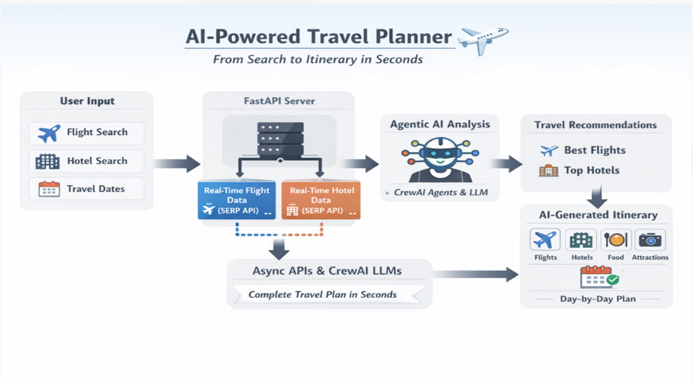

# AI-Powered Travel Planner

An end-to-end travel planning application that combines real-time travel search with AI recommendations. A user enters trip details, the system searches live flight and hotel options, and the AI helps recommend suitable choices and generate a day-by-day itinerary.

This project is designed to be understandable for both technical and non-technical readers. In simple terms:

- You enter where and when you want to travel.
- The app looks up flights and hotels using live travel data.
- AI compares the available options.
- The system returns recommendations and a ready-to-use itinerary.

## What This Project Does

The application helps with three core travel tasks:

- Flight search: finds live flight options and summarizes the best choice.
- Hotel search: finds hotel options and highlights a recommended stay.
- Trip planning: combines results into a readable travel itinerary.

## Key Features

- Real-time flight search using Google Flights data through SerpAPI
- Real-time hotel search using Google Hotels data through SerpAPI
- AI-powered flight and hotel recommendations
- AI-generated travel itinerary in Markdown format
- FastAPI backend with asynchronous request handling
- Modern browser-based frontend in the `frontend/` folder
- Legacy Streamlit frontend for quick demos and testing
- Downloadable itinerary output

## How It Works

1. The user fills in travel details such as origin, destination, and dates.
2. The frontend sends the request to the FastAPI backend.
3. The backend fetches flight and hotel data from SerpAPI.
4. CrewAI agents analyze the returned options.
5. The LLM generates recommendations and, if requested, a full itinerary.
6. Results are displayed in the UI.

## Screenshots

### Main UI


### Architecture Diagram



## Tech Stack

### Backend

- Python
- FastAPI
- Pydantic
- CrewAI
- OpenAI-compatible LLM integration
- SerpAPI
- Uvicorn

### Frontend

- HTML
- CSS
- JavaScript
- Streamlit

### Supporting Tools

- python-dotenv
- asyncio
- logging

## Current Project Structure

```text
Travel-ai-planner/
├── backend/
│   ├── __init__.py
│   ├── ai_agents.py        # AI agents for recommendations and itinerary generation
│   ├── app.py              # FastAPI application and API routes
│   ├── config.py           # Environment variables, provider settings, logger
│   ├── llm.py              # LLM initialization and provider error handling
│   ├── models.py           # Request and response models
│   └── search.py           # SerpAPI flight and hotel search logic
├── frontend/
│   ├── app.js              # Browser UI logic and API calls
│   ├── index.html          # Main web interface
│   └── style.css           # Frontend styling
├── Dockerfile              # Container setup
├── Diagram.png             # Architecture / project diagram
├── main.py                 # Minimal Python entry file
├── pyproject.toml          # Project metadata and dependencies
├── README.md               # Project documentation
├── requirements.txt        # pip-based dependency list
├── travel-ai.webp          # UI preview image
├── TravelPlanner.py        # Root API entry point for uvicorn
└── TravelPlanner_Streamlit.py  # Streamlit frontend
```

## Who This Is For

This project is useful for:

- Students learning how AI can be integrated into real applications
- Developers building GenAI portfolio projects
- Founders exploring a travel assistant MVP
- Interview preparation for full-stack or AI system design discussions

## Setup Requirements

Before running the project, make sure you have:

- Python 3.10 or newer
- A SerpAPI key
- Either a Groq API key or an OpenAI API key

## Environment Variables

Create a `.env` file in the project root with the values below:

```env
SERP_API_KEY=your_serpapi_key

# LLM provider configuration
LLM_PROVIDER=groq
LLM_MODEL=openai/gpt-oss-120b
LLM_REASONING_EFFORT=medium
LLM_BASE_URL=https://api.groq.com/openai/v1

# Use this when LLM_PROVIDER=groq
GROQ_API_KEY=your_groq_api_key

# Use this when LLM_PROVIDER=openai
OPENAI_API_KEY=your_openai_api_key
```

Notes:

- `LLM_PROVIDER` defaults to `groq` in the current codebase.
- `SERP_API_KEY` is required for travel search.
- Only one LLM provider key is needed based on the provider you choose.

## Installation

### Option 1: Install with pip

```powershell
python -m venv .venv
.\.venv\Scripts\Activate.ps1
.\.venv\Scripts\python.exe -m pip install --upgrade pip
.\.venv\Scripts\python.exe -m pip install -r requirements.txt
```

### Option 2: Install using project metadata

```powershell
python -m venv .venv
.\.venv\Scripts\Activate.ps1
.\.venv\Scripts\python.exe -m pip install --upgrade pip
.\.venv\Scripts\python.exe -m pip install .
```

## How To Run The Project

### Start the FastAPI backend

Run the backend from the project root:

```powershell
.\.venv\Scripts\python.exe -m uvicorn TravelPlanner:app --reload
```

The API will be available at:

```text
http://localhost:8000
```

### Open the web frontend

The polished browser UI lives in the `frontend/` folder.

You can open `frontend/index.html` directly in a browser, or serve it locally with any static file server. The frontend communicates with the FastAPI backend running on port `8000`.

### Run the Streamlit frontend

If you prefer the Streamlit version, run:

```powershell
.\.venv\Scripts\python.exe -m streamlit run TravelPlanner_Streamlit.py
```

The Streamlit app will usually open at:

```text
http://localhost:8501
```

## Recommended Run Flow

For the best experience:

1. Start the FastAPI backend.
2. Open the `frontend/index.html` interface.
3. Enter trip details.
4. Review live flights, hotels, and AI suggestions.
5. Download the generated itinerary if needed.

## API Endpoints

| Endpoint               | Method | Purpose                                                          |
| ---------------------- | ------ | ---------------------------------------------------------------- |
| `/search_flights/`     | `POST` | Search flights and return an AI recommendation                   |
| `/search_hotels/`      | `POST` | Search hotels and return an AI recommendation                    |
| `/complete_search/`    | `POST` | Search flights and hotels together and generate a trip itinerary |
| `/generate_itinerary/` | `POST` | Generate an itinerary from supplied flight and hotel text        |

## Example User Journey

Here is what happens from a user point of view:

1. Enter airport codes, destination, and travel dates.
2. Choose whether to search flights only, hotels only, or a complete trip.
3. Submit the search.
4. Review available options.
5. Read the AI recommendation.
6. Get a travel itinerary for the selected trip.

## AI Agent Roles

The app uses multiple AI roles to keep responsibilities clear:

- Flight Analyst: compares price, duration, stops, and convenience
- Hotel Analyst: compares rating, location, and pricing
- Travel Planner: turns the results into a day-by-day itinerary

## Error Handling

The application already includes basic handling for common AI provider issues such as:

- Invalid API keys
- Quota limits
- Rate limits
- Missing flight or hotel results

If you see a provider-related message in the UI, check your `.env` file and restart the backend.

## Docker

This repository includes a `Dockerfile`, which can be used to containerize the application. If you plan to use Docker, make sure the environment variables are provided to the container at runtime.

## Future Improvements

- User authentication
- Search caching and cost optimization
- LLM usage monitoring
- Multi-city itinerary support
- Structured JSON outputs
- Mobile-first UI improvements

## Summary

This project demonstrates how to combine live travel search, AI recommendations, and itinerary generation into one practical application. It is suitable as a portfolio project, learning project, or foundation for a travel assistant product.
